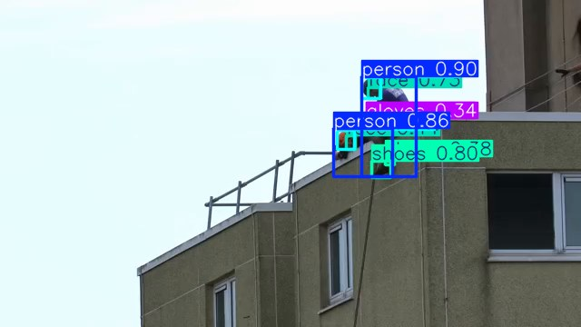
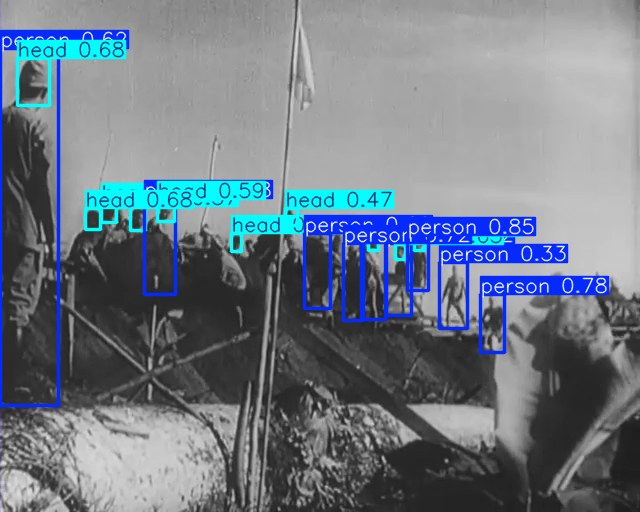

# Internet-video inference test results

The released `SH17_YOLOv9e_PPE_17class.pt` checkpoint was run on two openly reusable video excerpts. The committed outputs are H.264 MP4 videos and JPEG representative frames; audio was removed.

## Test settings

| Setting | Value |
|---|---:|
| Confidence threshold | 0.25 |
| NMS IoU threshold | 0.50 |
| Inference size | 640 px |
| Device used for this run | CPU |
| Frames per excerpt | 24 |
| Excerpt duration | 6 seconds |
| Output frame rate | 4 fps |

## Results

### Modern abseiling/construction scene

[View annotated MP4](test_results/abseiling_worker_annotated.mp4)



- Detected classes across the 24 sampled frames: person 32, head 25, gloves 19, helmet 11, shoes 11, face 5, hands 4, tool 1.
- Frames containing at least one detection: 23/24.
- CPU processing speed in this run: 1.576 frames/second.
- Source excerpt: 00:04–00:10 from [“Abseiling rappelling down a London tower block 54m 01”](https://commons.wikimedia.org/wiki/File:Abseiling_rappelling_down_a_London_tower_block_54m_01.webm).
- Original creator: Acabashi. Source and this annotated derivative are licensed under [CC BY-SA 4.0](https://creativecommons.org/licenses/by-sa/4.0/). Changes: trimmed, resized, sampled to 4 fps, muted, and overlaid with model predictions.

### Historical outdoor work scene

[View annotated MP4](test_results/historical_workers_annotated.mp4)



- Detected classes across the 24 sampled frames: person 151, head 82, foot 14, hands 5, ear 3, shoes 2, tool 2.
- Frames containing at least one detection: 24/24.
- CPU processing speed in this run: 1.351 frames/second.
- Source excerpt: 03:10–03:16 from [“Barisan Pekerdja”](https://commons.wikimedia.org/wiki/File:Barisan_Pekerdja.webm), provided by the Netherlands Institute for Sound and Vision.
- The source page identifies the original film as public domain/free of known copyright restrictions. Changes: trimmed, resized, sampled to 4 fps, muted, and overlaid with model predictions.

Machine-readable run details are in [`test_results/results_summary.json`](test_results/results_summary.json).

## Reproduce the test

Download the checkpoint from the repository release, prepare local video excerpts, and run:

```bash
python test_video_inference.py \
  path/to/abseiling_worker.mp4 \
  path/to/historical_workers.mp4 \
  --model SH17_YOLOv9e_PPE_17class.pt \
  --output test_results \
  --imgsz 640 --conf 0.25 --device cpu
```

The script writes one annotated video and representative JPEG per input plus a combined JSON summary. If FFmpeg is installed, it converts the result to browser-friendly H.264; otherwise it keeps OpenCV's MP4 output.

## Interpretation

Counts above are **frame-level detection occurrences**, not counts of unique people or equipment. These internet clips do not include ground-truth annotations, so they cannot produce a valid accuracy, precision, recall or mAP score. The model's published validation metrics remain the figures in the main README. The historical scene is intentionally a difficult domain-shift example and includes visible false positives, illustrating why site-specific validation is required before safety decisions.
